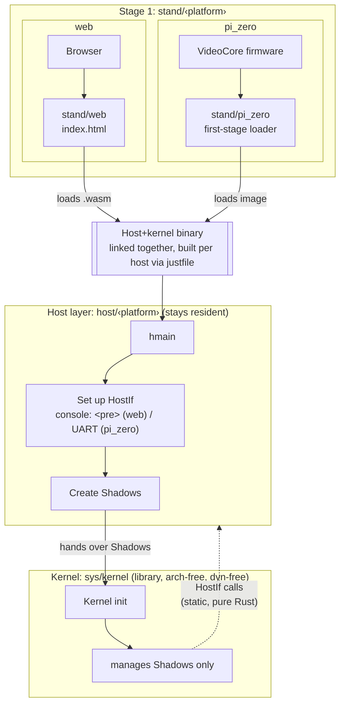

## Overview

```mermaid
flowchart TB
    subgraph stage1["Stage 1: stand/‹platform›"]
        direction LR
        subgraph web["web"]
            B["Browser"] --> W["stand/web<br/>index.html"]
        end
        subgraph pi["pi_zero"]
            F["VideoCore firmware"] --> P["stand/pi_zero<br/>first-stage loader"]
        end
    end

    W -- "loads .wasm" --> IMG
    P -- "loads image" --> IMG

    IMG[["Host+kernel binary<br/>linked together, built per host via justfile"]]

    subgraph host["Host layer: host/‹platform› (stays resident)"]
        H1["hmain"] --> H2["Set up HostIf<br/>console: &lt;pre&gt; (web) / UART (pi_zero)"]
        H2 --> H3["Create Shadows"]
    end

    subgraph kern["Kernel: sys/kernel (library, arch-free, dyn-free)"]
        K1["Kernel init"] --> K2["manages Shadows only"]
    end

    IMG --> H1
    H3 -- "hands over Shadows" --> K1
    K2 -. "HostIf calls<br/>(static, pure Rust)" .-> host
```
